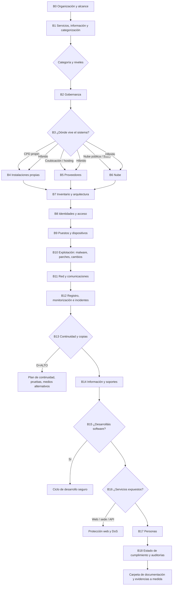

# Cuestionario de perfilado BLENS — diseño v0.1

> Documento compañero de `CLAUDE.md` (§10bis, M11). Define **qué se pregunta, en qué orden, con qué caminos** y **qué pide cada respuesta**, pensando en lo que solicita un auditor ENAC. Es la especificación del seed `db/seed/blens/questions` y `db/seed/blens/evidence_templates`. Medidas referenciadas por **id OSCAL**. **Pendiente de validar medida a medida contra CCN-STIC-808.**

---

## 1. Principios

1. **Tres capas por tema.**
   - **Descubrir** qué hay: herramientas, proveedores, ubicaciones.
   - **Cómo se hace:** procedimiento, periodicidad y responsable.
   - **Probarlo:** qué evidencia existe.
   
   Las dos primeras son preguntas; la tercera genera `EvidenceRequirement`.
2. **Solo se pregunta lo que aplica.** Cada bloque y cada pregunta lleva `show_if` sobre categoría, niveles por dimensión (`ens_applicability`) y hechos previos. Una PYME en Básica 100 % nube no ve preguntas de CPD ni de continuidad.
3. **"No lo sé" es una respuesta válida.** No bloquea: crea una tarea asignable y marca los requisitos afectados como `PENDIENTE`. **"No" tampoco bloquea:** genera un *gap* con acción recomendada. Muchas veces BLENS puede generar el documento que falta (M3).
4. **Toda herramienta nombrada es un componente.** Cada vez que el cliente nombra un producto (EDR, firewall, SIEM, IdP…) se crea un `SecurityComponent` y se lanza el flujo CPSTIC (op.pl.5, §10bis.2b): producto y versión, ruta y evidencias.
5. **Todo proveedor nombrado es un tercero.** Cada proveedor se registra en `op.ext` con sus datos: contrato, SLA, certificación ENS y categoría.
6. **Bloques delegables.** Cada bloque puede asignarse a una persona (IT, RRHH, instalaciones, legal) con fecha límite. Quien responde queda registrado para la trazabilidad.
7. **Periodicidad siempre explícita.** Si una práctica es periódica (formación, pruebas de restauración, revisión de accesos), se pregunta la frecuencia y la última fecha. Eso fija la `vigencia_dias` de la evidencia.
8. **Duración orientativa:**
   - Básica, 100 % nube: 30–45 min.
   - Media, híbrida: 2–3 h repartidas entre responsables.

Tipos de respuesta: `BOOL`, `SINGLE`, `MULTI`, `TEXT`, `NUMBER`, `DATE`, `TOOL` (producto → CPSTIC), `VENDOR` (proveedor → op.ext), `LIST` (tabla repetible).

---

## 1bis. Cómo se redacta cada pregunta (para que nadie responda "no lo sé")

**Regla de oro:** si el cliente tiene que traducir la pregunta, la pregunta está mal escrita. Se pregunta por **situaciones reconocibles**, no por conceptos de la norma.

### Anatomía de una pregunta
Cada `ProfileQuestion` lleva siempre estos campos:

| Campo | Para qué | Ejemplo |
|---|---|---|
| `texto` | La pregunta, en lenguaje de calle, una sola idea | "¿Los ordenadores tienen antivirus?" |
| `por_que` | Qué se juega el cliente. Una línea, sin citar artículos | "El auditor comprobará que **todos** los equipos están protegidos, no solo algunos" |
| `como_saberlo` | **Dónde mirar**, con la ruta concreta según lo que ya sabemos de él | "En Windows: Configuración → Privacidad y seguridad → Seguridad de Windows. Si usáis Microsoft 365: portal de Defender → Dispositivos" |
| `opciones` | Situaciones reales, no "sí/no" abstractos | "Sí, uno comprado (Defender, ESET…)" / "Sí, el que viene con Windows" / "En algunos equipos" / "No" |
| `ejemplos` | Casos que el cliente reconoce, uno por opción | — |
| `a_quien_preguntar` | Rol al que se delega si no lo sabe | "Quien gestiona los ordenadores (informático o proveedor de soporte)" |
| `glosario` | Términos técnicos que aparezcan, explicados al pasar el ratón | "EDR: antivirus avanzado que además vigila comportamientos" |

### Reglas de redacción
1. **Nada de "¿Disponen de mecanismos que garanticen…?"** Se pregunta por el hecho: "¿Alguien revisa quién tiene acceso a qué, cada cierto tiempo?".
2. **Una pregunta, una cosa.** "¿Tenéis política de seguridad aprobada y difundida?" son dos preguntas: existencia y difusión.
3. **Sin siglas sin explicar.** Si hace falta la sigla, va después: "copias de seguridad (backup)", "doble factor (MFA)".
4. **Las opciones describen realidades, incluida la incómoda.** Se incluye siempre la opción honesta ("Se hace, pero no está escrito", "Lo hace nuestro proveedor y no sé cómo"). Si el cliente ve su situación en la lista, la marca; si solo ve "sí/no", elige "no lo sé".
5. **"No lo sé" no es una opción del menú.** Es un botón aparte: **"Preguntárselo a otra persona"**, que exige elegir a quién y crea la tarea. Así el dato llega, no se pierde.
6. **Se pregunta por lo que se ve, no por lo que se cumple.** En vez de "¿Cumplís op.exp.8?": "¿Se guarda un registro de quién entra en el sistema y qué hace? ¿Cuánto tiempo se guarda?".
7. **Se aprovecha lo ya respondido.** Si dijo que usa Microsoft 365, la pregunta y el `como_saberlo` hablan de Microsoft 365, con su ruta de menús. Nada de instrucciones genéricas.
8. **Números con referencia.** No "¿cuál es vuestro RTO?", sino "si el servicio se cae un lunes por la mañana, ¿cuánto puede estar parado antes de que sea un problema grave? (menos de 4 horas / un día / una semana)".
9. **Si el cliente no puede saberlo, no se le pregunta.** Lo que depende del proveedor se pregunta como "¿lo hace vuestro proveedor?" y genera una **petición de información al proveedor** (email con el texto ya redactado), no una pregunta al cliente.
10. **Progresivo.** Primero la pregunta simple; el detalle solo si la respuesta lo exige. Quien responde "No" no ve las cinco preguntas de detalle: ve la acción recomendada.
11. **Estimación de esfuerzo visible** por bloque ("5 preguntas, unos 4 minutos") y guardado automático, para que nadie abandone.
12. **Lenguaje llano medible.** Frases de menos de 20 palabras, sin subordinadas. Si una pregunta no se entiende leída en voz alta, se reescribe.

### Ejemplos completos (modelo de redacción)

**B10.1 — Antivirus / EDR**
> **¿Los ordenadores y servidores tienen antivirus?**
> *Por qué:* el auditor mirará que estén protegidos **todos**, y que el antivirus esté actualizado y vigilado.
> *Cómo saberlo:* si usáis Microsoft 365, entrad en el portal de Defender → Dispositivos; si tenéis otro (ESET, Sophos, CrowdStrike…), en su consola verás cuántos equipos aparecen.
> **Opciones:** Sí, uno contratado · Sí, el que trae Windows · Solo en algunos equipos · Lo gestiona nuestro proveedor · No
> *Luego:* ¿cuántos equipos hay en total y cuántos aparecen en la consola?
> *Necesitaréis:* una captura de la consola donde se vea la lista de equipos y la fecha de actualización.

**B4.4 — Energía del CPD**
> **Si se va la luz, ¿los servidores siguen encendidos un rato?**
> *Por qué:* hay que demostrar que una caída de luz no corta el servicio ni corrompe datos.
> *Cómo saberlo:* mirad si hay una caja con baterías conectada al rack (un SAI). Suele tener pantalla y pitar cuando falla la corriente.
> **Opciones:** Sí, hay SAI · Sí, SAI y generador · No, se apagan · No lo sé (→ preguntar a mantenimiento)
> *Luego:* ¿cuántos minutos aguanta? ¿Cuándo se probó por última vez?

**B8.4 — Revisión de accesos**
> **¿Alguien comprueba cada cierto tiempo quién tiene acceso a qué?**
> *Por qué:* es el hallazgo más habitual: gente que se fue y sigue teniendo cuenta.
> *Cómo saberlo:* pensad si existe una lista o un correo periódico donde los responsables confirman los accesos de su equipo.
> **Opciones:** Sí, cada 6 meses o menos · Sí, una vez al año · Solo cuando alguien se va · No se revisa
> *Necesitaréis:* la última revisión con fecha y quién la aprobó.

**B12.2 — Retención de registros**
> **¿Cuánto tiempo se guardan los registros de actividad (los "logs")?**
> *Por qué:* si hay un incidente hay que poder mirar atrás; el auditor pregunta por el plazo configurado, no por el deseado.
> *Cómo saberlo:* en vuestro sistema de logs o SIEM, en la configuración de retención. En Microsoft 365 está en el portal de cumplimiento → Auditoría.
> **Opciones:** Menos de 3 meses · 3–6 meses · 6–12 meses · Más de un año · No lo sé (→ preguntar a quien administra)

**B5.2 — Certificación ENS del proveedor** (pregunta que no es para el cliente)
> **¿Vuestro proveedor de [nombre] está certificado en ENS?**
> *Por qué:* si presta el servicio dentro de vuestro alcance, su conformidad debe ser al menos de vuestra categoría.
> **Opciones:** Sí, tengo el certificado · Creo que sí, pero no lo tengo · No · No lo sé
> *En los tres últimos casos:* BLENS prepara el **email al proveedor** pidiendo el certificado y su alcance. Solo hay que revisarlo y enviarlo.

### Medición
- **Tasa de "preguntárselo a otra persona" por pregunta.** Si supera el 20 %, la pregunta está mal redactada o mal dirigida: se reescribe o se mueve a otro bloque o rol.
- **Tiempo por pregunta** y abandono por bloque.
- **Prueba con usuarios reales:** 3 clientes tipo (PYME, ayuntamiento, proveedor SaaS) leyendo en voz alta antes de cerrar el seed.

---

## 2. Mapa de caminos

---

## 3. Bloques

Columnas: **ID** · **Pregunta** · **Respuesta** · **Condición** (`show_if`) · **Hechos** que emite · **Medidas** · **Evidencias / efecto**.

### B0 · Organización y alcance
| ID | Pregunta | Respuesta | Condición | Hechos | Medidas | Evidencias / efecto |
|---|---|---|---|---|---|---|
| B0.1 | ¿Qué tipo de entidad sois? | SINGLE: AGE / CCAA / Entidad local / Universidad / Otra pública / Empresa proveedora del sector público / Otra privada | — | `entidad.tipo` | org.1 | Define obligación INES, destinatario de notificación de incidentes y lenguaje de las plantillas |
| B0.2 | ¿Por qué necesitáis el ENS? | MULTI: Obligación legal / Licitación / Cliente lo exige / Mejora interna | — | `motivo` | — | Prioriza el camino más corto a conformidad |
| B0.3 | ¿Qué servicios o sistemas entran en el alcance? | LIST (nombre, descripción, usuarios) | — | `servicios[]` | org.1, op.pl.2 | Genera `System`; **documento de alcance** (generable) |
| B0.4 | ¿Es vuestra primera certificación o una renovación? | SINGLE: Primera / Renovación / Adecuación sin certificar | — | `ciclo` | — | Renovación: pide informe de auditoría previo y plan de acciones correctivas (PAC) |
| B0.5 | ¿Cuántas personas trabajan con el sistema? ¿Cuántas sedes? | NUMBER ×2 | — | `personas`, `sedes` | mp.per, mp.if | Dimensiona los requisitos de formación y de instalaciones |
| B0.6 | ¿Os aplica algún Perfil de Cumplimiento Específico? | SINGLE: Sí (cuál) / No / No lo sé | — | `pce` | org.1 | Ajusta la DdA inicial; a validar contra perfiles publicados por el CCN |
| B0.7 | Sedes y ubicaciones en alcance | LIST (dirección, uso: oficina, CPD o ambos, nº personas) | — | `sedes[]` | mp.if | **Ficha previa (§7):** determina las visitas presenciales |
| B0.8 | Volumen técnico aproximado | NUMBER ×3: servidores o instancias, puestos, aplicaciones | — | `volumen` | op.exp.1 | Ficha previa: dimensiona el muestreo |
| B0.9 | ¿Hay teletrabajo o personal en remoto? | SINGLE: No / Parcial / Mayoritario | — | `remoto` | op.acc, mp.eq.3 | Ficha previa: posibilidad de auditoría en remoto |
| B0.10 | ¿Algún proceso del servicio está subcontratado entero (p. ej. operación o soporte 24x7)? | BOOL + VENDOR | — | `outsourcing` | op.ext | Ficha previa: el auditor puede necesitar acceso al subcontratista |

### B1 · Servicios, información y categorización (M1)
| ID | Pregunta | Respuesta | Condición | Hechos | Medidas | Evidencias / efecto |
|---|---|---|---|---|---|---|
| B1.1 | Por cada servicio: ¿qué información maneja? | LIST (tipo de información, ejemplos) | — | `info[]` | mp.info.2 | Base de la valoración |
| B1.2 | Impacto si la información se **filtra** (C) / se **altera** (I) / no se sabe **quién** accedió (T) / se **suplanta** a alguien (A) / el servicio **no está disponible** (D) | 5 × SINGLE: N/A · Bajo · Medio · Alto, con ejemplos guiados | — | `nivel.C..D` | Anexo I | `DimensionValuation`; **documento de categorización** firmado (generable) |
| B1.3 | ¿Tratáis datos personales? ¿De categorías especiales? | BOOL + MULTI | — | `rgpd`, `rgpd.especiales` | mp.info.1 | Pide registro de actividades (RAT), análisis de riesgos o EIPD si procede, y designación de DPD |
| B1.4 | ¿Cuánto tiempo puede estar parado el servicio sin daño grave? | SINGLE: <4 h / 1 día / 1 semana / Más | `nivel.D ≥ MEDIO` | `rto_orientativo` | op.cont.1 | Anticipa el análisis de impacto |
| B1.5 | ¿Quién aprueba la categorización? | TEXT (rol) | — | `aprobador_cat` | org.1 | Acta o firma de aprobación |

### B2 · Gobernanza (org)
| ID | Pregunta | Respuesta | Condición | Hechos | Medidas | Evidencias / efecto |
|---|---|---|---|---|---|---|
| B2.1 | ¿Tenéis una política de seguridad aprobada? | SINGLE: Sí vigente / Sí sin actualizar / No | — | `politica` | org.1 | Sí: documento + **acta o resolución de aprobación** + evidencia de difusión. No: **se genera** (M3) |
| B2.2 | ¿Están designados los roles (Resp. Información, Servicio, Seguridad, Sistema)? | LIST (rol, persona, fecha) | — | `roles[]` | org.1 | Nombramientos firmados; se revisa la **separación RSEG/RSIS** |
| B2.3 | ¿Existe Comité de Seguridad? ¿Cada cuánto se reúne? | BOOL + SINGLE (frecuencia) + DATE (última) | — | `comite` | org.1 | Últimas actas (vigencia según frecuencia) |
| B2.4 | ¿Tenéis normativa de uso (correo, Internet, equipos, contraseñas)? | MULTI de normas + "Ninguna" | — | `normativa[]` | org.2 | Normas aprobadas + **acuse firmado por el personal**; lo que falta se genera |
| B2.5 | ¿Tenéis procedimientos operativos escritos (altas y bajas, copias, incidentes…)? | MULTI | — | `procs[]` | org.3 | Procedimientos con versión y aprobación (M8) |
| B2.6 | Antes de conectar equipos, software o servicios nuevos, ¿alguien lo autoriza? | SINGLE: Sí formal / Informal / No | — | `autorizacion` | org.4, op.pl.3 | Registro de autorizaciones o solicitudes aprobadas |
| B2.7 | ¿Tenéis un análisis de riesgos? ¿Con qué metodología y fecha? | SINGLE: No / Informal / MAGERIT-PILAR / Otra + DATE | — | `ar` | op.pl.1 | Existente: informe y aprobación. No o desactualizado: **se hace en M7** |

### B3 · ¿Dónde vive el sistema? (bifurcación principal)
| ID | Pregunta | Respuesta | Condición | Hechos | Medidas | Evidencias / efecto |
|---|---|---|---|---|---|---|
| B3.1 | ¿Dónde están los servidores y datos del sistema? | MULTI: CPD o sala propia / Coubicación o hosting / Nube pública IaaS-PaaS / Aplicaciones SaaS / Solo puestos, sin servidores | — | `infra.ubicacion[]` | mp.if, op.ext, op.nub | Activa B4, B5 y/o B6 |
| B3.2 | ¿Qué nubes o SaaS usáis? | VENDOR repetible (AWS, Azure, GCP, M365, Google Workspace, Salesforce…) + región | `infra ∋ nube o SaaS` | `nube[]` | op.nub.1, op.ext.1 | Cada uno es un tercero. Pide **certificado ENS del proveedor** (categoría ≥ la propia) y la región de los datos |
| B3.3 | ¿Tenéis oficinas donde se trate información del sistema? | BOOL | — | `oficinas` | mp.if.1–2, mp.eq.1 | Aunque todo esté en nube, **las oficinas siguen en alcance** para el control de acceso físico y el puesto despejado |

### B4 · Instalaciones propias (camino "CPD propio")
`show_if: infra.ubicacion ∋ CPD propio`
| ID | Pregunta | Respuesta | Condición | Hechos | Medidas | Evidencias |
|---|---|---|---|---|---|---|
| B4.1 | ¿La sala está separada y con acceso restringido? ¿Cómo? | MULTI: Llave / Tarjeta / Biometría / Vigilancia | — | `cpd.acceso` | mp.if.1 | **Fotos de puerta y control de acceso**, plano o croquis, lista de personas autorizadas |
| B4.2 | ¿Se registra quién entra? | SINGLE: Registro electrónico / Libro / No | — | `cpd.registro` | mp.if.2 | Extracto del registro de accesos (último trimestre) |
| B4.3 | ¿Tiene climatización adecuada y mantenida? | BOOL + VENDOR (mantenedor) | — | `cpd.clima` | mp.if.3 | Contrato y **partes de mantenimiento** |
| B4.4 | ¿SAI / grupo electrógeno? Autonomía | BOOL ×2 + NUMBER (min) + DATE (última prueba) | `nivel.D ≥ BAJO` | `cpd.energia` | mp.if.4 | Ficha del SAI, **informe de prueba**, contrato de mantenimiento |
| B4.5 | ¿Detección y extinción de incendios? | MULTI | — | `cpd.incendios` | mp.if.5 | Certificado de instalación y **revisión periódica** del mantenedor autorizado |
| B4.6 | ¿Riesgo de inundación (sótano, tuberías)? ¿Medidas? | SINGLE + TEXT | `nivel.D ≥ MEDIO` | `cpd.inundacion` | mp.if.6 | Fotos de detectores o elevación; valoración del riesgo |
| B4.7 | ¿Se registra la entrada y salida de equipos? | BOOL | — | `cpd.equipos_es` | mp.if.7 | Registro de entradas y salidas de equipamiento |

### B5 · Proveedores y servicios externos
| ID | Pregunta | Respuesta | Condición | Hechos | Medidas | Evidencias |
|---|---|---|---|---|---|---|
| B5.1 | ¿Qué proveedores prestan servicios TIC al sistema (hosting, soporte, desarrollo, SOC, copias…)? | VENDOR repetible (servicio, criticidad) | — | `proveedores[]` | op.ext.1 | Por proveedor: **contrato con cláusulas de seguridad y SLA**, encargo de tratamiento si hay datos personales |
| B5.2 | ¿Están certificados en ENS? ¿En qué categoría? | Por proveedor: SINGLE + DATE (caducidad) | `categoria ≥ MEDIA` | `prov.ens` | op.ext.1, op.nub.1 | **Certificado de conformidad** vigente. Si no lo tiene: justificación y medidas contractuales |
| B5.3 | ¿Recibís informes periódicos del servicio y hacéis seguimiento? | SINGLE + frecuencia | `categoria ≥ MEDIA` | `prov.seguimiento` | op.ext.2 | Informes de servicio y **actas de seguimiento** |
| B5.4 | ¿Algún proveedor os entrega componentes o software críticos? | BOOL + LIST | `categoria = ALTA` | `supply_chain` | op.ext.3 | Análisis de la cadena de suministro y requisitos exigidos |
| B5.5 | ¿El sistema se conecta con sistemas de terceros (otras AAPP, SARA, pasarelas, APIs de clientes)? | LIST (sistema, tipo, dirección) | `categoria ≥ MEDIA` | `interconexiones[]` | op.ext.4 | **Acuerdos de interconexión**, diagrama y autorización |

### B6 · Nube (camino "nube / SaaS")
`show_if: infra.ubicacion ∋ nube o SaaS`
| ID | Pregunta | Respuesta | Condición | Hechos | Medidas | Evidencias |
|---|---|---|---|---|---|---|
| B6.1 | ¿Quién administra la configuración de seguridad de la nube? | SINGLE: Interno / Proveedor / Mixto | — | `nube.admin` | op.nub.1 | Matriz de responsabilidad compartida |
| B6.2 | ¿Aplicáis una guía de configuración segura (CCN-STIC de la plataforma, CIS…)? | SINGLE + TEXT (cuál) | — | `nube.bastionado` | op.nub.1, op.exp.2 | **Capturas o export de configuración** que demuestren los puntos clave: MFA de administración, registro activado, cifrado, región |
| B6.3 | ¿Usáis herramientas de postura de seguridad (Defender for Cloud, Security Hub…)? | TOOL | — | → componente | op.nub.1, op.mon | Informe de postura reciente |

### B7 · Inventario y arquitectura
| ID | Pregunta | Respuesta | Condición | Hechos | Medidas | Evidencias |
|---|---|---|---|---|---|---|
| B7.1 | ¿Tenéis inventario de activos? ¿Con qué herramienta? | SINGLE (Excel / CMDB / Ninguno) + TOOL | — | `inventario` | op.exp.1 | **Export del inventario** con responsable por activo. Se importa a `Asset` (M7) |
| B7.2 | ¿Hay un diagrama de red o arquitectura actualizado? | BOOL + DATE | — | `diagrama` | op.pl.2 | Diagrama con zonas, perímetros y flujos |
| B7.3 | ¿Cómo se decide qué se compra (requisitos de seguridad, CPSTIC)? | SINGLE | — | `compras` | op.pl.3, op.pl.5 | Procedimiento de adquisición y ejemplo de expediente |
| B7.4 | ¿Se vigila la capacidad (CPU, disco, ancho de banda)? | SINGLE + TOOL | `nivel.D ≥ BAJO` | `capacidad` | op.pl.4 | Informe o captura de monitorización de capacidad |

### B8 · Identidades y acceso (op.acc)
| ID | Pregunta | Respuesta | Condición | Hechos | Medidas | Evidencias |
|---|---|---|---|---|---|---|
| B8.1 | ¿Dónde se gestionan las cuentas de usuario? | TOOL (AD, Entra ID, Google, LDAP, IdP…) | — | → componente `IdP` | op.acc.1 | Export de usuarios con estado. **Muestreo de cuentas nominales** (sin genéricas) |
| B8.2 | ¿Hay cuentas compartidas o genéricas? | SINGLE + TEXT (justificación) | — | `cuentas_genericas` | op.acc.1 | Justificación y trazabilidad del uso |
| B8.3 | ¿Cómo se dan de alta y de baja los accesos? ¿Quién aprueba? | SINGLE (procedimiento, ticket o informal) | — | `altas_bajas` | op.acc.4 | **Muestra de 3–5 tickets** de alta y de baja; procedimiento |
| B8.4 | ¿Se revisan periódicamente los permisos? | SINGLE (frecuencia) + DATE | — | `revision_accesos` | op.acc.4 | Última revisión firmada (vigencia según frecuencia) |
| B8.5 | ¿Las tareas críticas están separadas (quien desarrolla no aprueba, quien administra no audita…)? | BOOL + TEXT | `nivel(C,I,T,A) ≥ MEDIO` | `segregacion` | op.acc.3 | Matriz de funciones incompatibles |
| B8.6 | ¿Qué se usa para autenticar al personal? | MULTI: Contraseña / MFA app / Token / Certificado / Tarjeta criptográfica | — | `auth.internos` | op.acc.6 | **Captura de la política de MFA obligatoria** y de la política de contraseñas; elección del refuerzo según nivel (param OSCAL) |
| B8.7 | ¿Acceden usuarios externos (ciudadanos, clientes)? ¿Cómo se autentican? | BOOL + MULTI (Cl@ve, certificado, usuario y contraseña, MFA) | — | `auth.externos` | op.acc.5 | Captura de la configuración; elección del refuerzo según nivel |
| B8.8 | ¿Cómo se gestionan las cuentas de administrador? ¿Usáis PAM? | SINGLE + TOOL | — | → componente `PAM` | op.acc.2, op.acc.6 | Lista de administradores, MFA reforzado y registro de sesiones |
| B8.9 | ¿Hay acceso remoto (VPN, escritorio remoto)? | BOOL + TOOL | — | → componente `VPN` | op.acc.6, mp.com | Configuración de VPN, MFA y registro de conexiones |

### B9 · Puestos de trabajo y dispositivos
| ID | Pregunta | Respuesta | Condición | Hechos | Medidas | Evidencias |
|---|---|---|---|---|---|---|
| B9.1 | ¿Qué sistemas operativos usáis en puestos y servidores? | MULTI + versiones | — | `so[]` | op.exp.2 | Base para las guías de bastionado aplicables |
| B9.2 | ¿Aplicáis configuración segura o bastionado? ¿Con qué guía o herramienta (CCN-STIC, CLARA, GPO, Intune)? | SINGLE + TOOL | — | `bastionado` | op.exp.2, op.exp.3 | **Informe de cumplimiento de bastionado** (p. ej. CLARA) o capturas de GPO/Intune |
| B9.3 | ¿Se bloquea el puesto por inactividad? ¿Existe norma de mesa limpia? | BOOL ×2 + NUMBER (min) | — | `bloqueo`, `mesa_limpia` | mp.eq.1, mp.eq.2 | Captura de la política de bloqueo y norma firmada |
| B9.4 | ¿Hay portátiles? ¿Discos cifrados? | BOOL + SINGLE (BitLocker, FileVault…) | — | `portatiles` | mp.eq.3 | **Informe de estado de cifrado** de la consola e inventario de portátiles |
| B9.5 | ¿Móviles con acceso a datos corporativos? ¿Gestionados con MDM/UEM? | BOOL + TOOL | — | → componente `UEM` | mp.eq.3 | Captura de políticas y cumplimiento de la flota |
| B9.6 | ¿Hay otros dispositivos en red (impresoras, cámaras, IoT)? | LIST | `nivel.C ≥ BAJO` | `otros_disp[]` | mp.eq.4 | Inventario y configuración: credenciales por defecto cambiadas, segmentación |

### B10 · Explotación: malware, parches, cambios
| ID | Pregunta | Respuesta | Condición | Hechos | Medidas | Evidencias |
|---|---|---|---|---|---|---|
| B10.1 | ¿Qué protección antimalware o EDR usáis? ¿En qué equipos? | TOOL + cobertura (%) | — | → componente `EPP/EDR` | op.exp.6 | **Captura de la consola con cobertura**, política aplicada y firmas actualizadas; export de detecciones |
| B10.2 | ¿Cómo se aplican los parches? ¿Con qué herramienta y plazo? | TOOL + SINGLE (plazo críticos) | — | → componente, `parcheo` | op.exp.4 | **Informe de cumplimiento de parches**; procedimiento y excepciones justificadas |
| B10.3 | ¿Se gestionan las vulnerabilidades (escáner, avisos CCN-CERT)? | SINGLE + TOOL | — | `vulns` | op.exp.4 | Último informe de escaneo y seguimiento de remediación |
| B10.4 | ¿Los cambios en sistemas pasan por un proceso (petición, prueba, aprobación, vuelta atrás)? | SINGLE + TOOL (ITSM) | `categoria ≥ MEDIA` | `cambios` | op.exp.5 | **Muestra de 3 cambios** con aprobación y prueba |
| B10.5 | ¿Usáis cifrado o certificados? ¿Cómo se custodian las claves? | MULTI (HSM, KMS, bóveda, ficheros) + TOOL | — | → componente | op.exp.10 | Procedimiento del ciclo de vida de claves e inventario de certificados con caducidad |

### B11 · Red y comunicaciones
| ID | Pregunta | Respuesta | Condición | Hechos | Medidas | Evidencias |
|---|---|---|---|---|---|---|
| B11.1 | ¿Qué cortafuegos protege el perímetro? | TOOL (uno o varios) | — | → componente `Firewall` | mp.com.1 | Diagrama, **export o captura de reglas** y revisión periódica de reglas |
| B11.2 | ¿La red está segmentada (usuarios, servidores, invitados, gestión)? | SINGLE + TEXT | `categoria ≥ MEDIA` | `segmentacion` | mp.com.4 | Diagrama de VLAN/zonas; elección del refuerzo (param OSCAL) |
| B11.3 | ¿Las comunicaciones con datos van cifradas (TLS, VPN)? | SINGLE + TEXT | `nivel.C ≥ BAJO` o `nivel(I,A) ≥ BAJO` | `cifrado_transito` | mp.com.2, mp.com.3 | Capturas de configuración TLS e informe de escaneo SSL |
| B11.4 | ¿Wi-Fi corporativa? ¿Separada de la de invitados? | BOOL + TOOL | — | → componente `WLAN` | mp.com.1, mp.com.4 | Configuración (WPA2/3-Enterprise) y separación |
| B11.5 | ¿Usáis IDS/IPS? | TOOL | — | → componente | op.mon.1 | Captura de la consola y última revisión de alertas |

### B12 · Registro, monitorización e incidentes
| ID | Pregunta | Respuesta | Condición | Hechos | Medidas | Evidencias |
|---|---|---|---|---|---|---|
| B12.1 | ¿Se registran las actividades de usuarios y administradores? ¿Dónde se centralizan? | SINGLE + TOOL (SIEM, gestor de logs) | `nivel.T ≥ BAJO` | → componente `SIEM` | op.exp.8 | **Captura de fuentes integradas**, retención configurada y protección de los registros |
| B12.2 | ¿Cuánto tiempo se guardan los registros? | NUMBER (meses) | — | `retencion_logs` | op.exp.8 | Captura de la política de retención |
| B12.3 | ¿Alguien revisa alertas? ¿SOC interno o externo? | SINGLE + VENDOR | — | `soc` | op.mon.1, op.mon.3 | Contrato SOC, **informes periódicos** y ejemplo de alerta gestionada |
| B12.4 | ¿Tenéis procedimiento de gestión de incidentes? | BOOL | — | `proc_incidentes` | op.exp.7 | Procedimiento aprobado; se genera si falta |
| B12.5 | ¿Dónde se registran los incidentes? ¿A quién se notifican? | TOOL (ITSM, LUCIA…) + SINGLE (CCN-CERT / INCIBE-CERT / organismo contratante) | — | `registro_incidentes`, `notificacion` | op.exp.7, op.exp.9 | **Registro de incidentes** del periodo y ejemplo de notificación (si la hubo) |
| B12.6 | ¿Medís la seguridad (indicadores)? ¿Reportáis a INES? | BOOL + BOOL | `entidad.tipo ∈ públicas` → INES obligatorio | `metricas`, `ines` | op.mon.2 | Cuadro de indicadores y **justificante del último envío a INES** |
| B12.7 | ¿Os suscribís a alertas de vigilancia (CCN-CERT, fabricantes)? | BOOL + TEXT | — | `vigilancia` | op.mon.3 | Evidencia de suscripción y de tratamiento de un aviso |

### B13 · Copias y continuidad
| ID | Pregunta | Respuesta | Condición | Hechos | Medidas | Evidencias |
|---|---|---|---|---|---|---|
| B13.1 | ¿Qué herramienta hace las copias? ¿De qué, con qué frecuencia y dónde se guardan? | TOOL + LIST (sistema, frecuencia, destino, cifrada, inmutable) | — | → componente `Backup` | mp.info.6 | **Captura de la política de copias** y registro de ejecuciones |
| B13.2 | ¿Cuándo probasteis por última vez una restauración? | DATE + TEXT | — | `prueba_restauracion` | mp.info.6 | **Acta de prueba de restauración** (vigencia 12 meses o la fijada) |
| B13.3 | ¿Hay análisis de impacto (qué es crítico y cuánto puede parar)? | BOOL + DATE | `nivel.D ≥ MEDIO` | `bia` | op.cont.1 | BIA aprobado; se genera desde B1.4 y M7 |
| B13.4 | ¿Plan de continuidad? ¿Probado? ¿Medios alternativos? | BOOL ×3 + DATE | `nivel.D = ALTO` | `pcn` | op.cont.2–4 | Plan, **informe de la última prueba** y contratos de medios alternativos |

### B14 · Información y soportes
| ID | Pregunta | Respuesta | Condición | Hechos | Medidas | Evidencias |
|---|---|---|---|---|---|---|
| B14.1 | ¿Clasificáis o calificáis la información (uso interno, confidencial…)? | BOOL | `nivel.C ≥ MEDIO` | `calificacion` | mp.info.2 | Norma de calificación y ejemplo de documento marcado |
| B14.2 | ¿Usáis firma electrónica? ¿Qué plataforma? ¿Sellos de tiempo? | BOOL + TOOL + BOOL | `nivel(I,A) ≥ BAJO` / `nivel.T = ALTO` | → componente | mp.info.3, mp.info.4 | Captura de la configuración y certificados usados (algoritmos) |
| B14.3 | ¿Se limpian los metadatos de los documentos que se publican o envían? | SINGLE + TOOL | `nivel.C ≥ BAJO` | `metadatos` | mp.info.5 | Procedimiento y captura de la herramienta |
| B14.4 | ¿Se usan soportes extraíbles (USB, discos)? ¿Están controlados o bloqueados? | SINGLE | — | `soportes` | mp.si.1–4 | Captura de la política de bloqueo o control, inventario y custodia |
| B14.5 | ¿Cómo se borran o destruyen equipos y soportes al retirarlos? | SINGLE + VENDOR | `nivel.C ≥ BAJO` | `destruccion` | mp.si.5 | **Certificados de destrucción** o borrado seguro |

### B15 · Desarrollo de software (camino "desarrollamos")
| ID | Pregunta | Respuesta | Condición | Hechos | Medidas | Evidencias |
|---|---|---|---|---|---|---|
| B15.1 | ¿Desarrolláis o encargáis desarrollo de software para el sistema? | SINGLE: Interno / Externo / Ambos / No | — | `desarrollo` | mp.sw.1 | Activa B15.2–B15.4 |
| B15.2 | ¿Entornos separados (desarrollo, pruebas, producción)? ¿Datos reales en pruebas? | BOOL ×2 | `desarrollo ≠ No` y `categoria ≥ MEDIA` | `entornos` | mp.sw.1 | Diagrama de entornos; justificación si hay datos reales |
| B15.3 | ¿Revisión de código o análisis SAST/DAST, dependencias, SBOM? | MULTI + TOOL | `desarrollo ≠ No` | → componente | mp.sw.1 | Informes de análisis y SBOM si aplica el refuerzo |
| B15.4 | Antes de pasar a producción, ¿hay pruebas y aceptación formal? | BOOL | — | `aceptacion` | mp.sw.2 | **Acta de aceptación** de la última puesta en producción |

### B16 · Servicios expuestos (correo, web, navegación, DoS)
| ID | Pregunta | Respuesta | Condición | Hechos | Medidas | Evidencias |
|---|---|---|---|---|---|---|
| B16.1 | ¿Qué correo usáis? ¿Qué protección tiene (antispam, antiphishing, SPF/DKIM/DMARC)? | TOOL + MULTI | — | → componente | mp.s.1 | Captura de la configuración de protección y **registros DNS SPF/DKIM/DMARC** |
| B16.2 | ¿Tenéis webs, sede electrónica, APIs o apps accesibles desde Internet? | LIST (URL, tipo) + TOOL (WAF) | — | `servicios_web[]` | mp.s.2 | **Informe de pentest o análisis de vulnerabilidades web**, configuración del WAF; elección del refuerzo (param OSCAL) |
| B16.3 | ¿Se filtra la navegación web del personal? | SINGLE + TOOL (proxy, DNS seguro) | — | → componente | mp.s.3 | Captura de la política de filtrado |
| B16.4 | ¿Protección frente a denegación de servicio? | SINGLE + VENDOR | `nivel.D ≥ MEDIO` | `anti_dos` | mp.s.4 | Contrato o configuración anti-DoS y prueba o informe |

### B17 · Personas (mp.per)
| ID | Pregunta | Respuesta | Condición | Hechos | Medidas | Evidencias |
|---|---|---|---|---|---|---|
| B17.1 | ¿Están definidos los puestos con responsabilidades de seguridad? | BOOL | `categoria ≥ MEDIA` | `puestos` | mp.per.1 | Descripción de puestos o funciones |
| B17.2 | ¿El personal firma deberes de confidencialidad y uso aceptable? ¿Y los externos? | BOOL ×2 | — | `deberes` | mp.per.2 | **Modelo firmado** y muestra de firmas (propios y externos) |
| B17.3 | ¿Hacéis concienciación? ¿Cómo, cada cuánto, última fecha? | MULTI (charlas, e-learning, phishing simulado, píldoras) + SINGLE + DATE + TOOL | — | `concienciacion` | mp.per.3 | **Email de convocatoria**, material, **lista de asistencia o registro de la plataforma**, resultados de la simulación |
| B17.4 | ¿Formación específica para técnicos y administradores? | BOOL + LIST (curso, persona, fecha) | — | `formacion` | mp.per.4 | Certificados o diplomas y plan de formación |

### B18 · Estado de cumplimiento y auditorías
| ID | Pregunta | Respuesta | Condición | Hechos | Medidas | Evidencias |
|---|---|---|---|---|---|---|
| B18.1 | ¿Tenéis otras certificaciones (ISO 27001, 22301, 9001)? | MULTI + DATE | — | `otras_cert` | — | Certificados; BLENS **reutiliza evidencias** mapeando controles |
| B18.2 | ¿Auditorías previas del ENS? ¿No conformidades abiertas? | BOOL + LIST | `ciclo = Renovación` | `nc[]` | — | Informe previo y **PAC con estado** |
| B18.3 | ¿Fecha objetivo de auditoría? ¿Entidad de certificación elegida? | DATE + TEXT | `categoria ≥ MEDIA` | `fecha_auditoria` | — | Planifica hitos y alertas; perfil de auditor para el paquete (§10) |

---

## 4. Reglas transversales

1. **`TOOL`** → crea un `SecurityComponent` con función inferida del bloque. Pide producto y versión y lanza el flujo CPSTIC (§10bis.2b): ruta, evidencias y, si la ruta es CPSTIC, amenaza de riesgo residual en M7.
2. **`VENDOR`** → alta del proveedor en op.ext. Pide contrato, SLA, certificado ENS y su caducidad, y encargo de tratamiento si hay datos personales. Si es nube, se aplica también op.nub.1.
3. **Respuesta "No"** a una práctica obligatoria → *gap* con:
   - acción recomendada,
   - documento generable si existe plantilla,
   - plazo sugerido según el umbral de madurez de la categoría.
4. **"No lo sé"** → tarea asignable; los requisitos afectados quedan en `PENDIENTE`.
5. **Periodicidad** → `vigencia_dias` de la evidencia y recordatorio antes de caducar.
6. **Muestreo auditor.** Cuando el auditor verifica por muestra (tickets, cambios, altas y bajas), BLENS pide **3–5 ejemplos del periodo auditado**, no uno.
7. **Coherencia cruzada** (validaciones que un auditor detectaría):
   - D=ALTO sin plan de continuidad (B13.4).
   - Nube en uso sin certificado ENS del proveedor.
   - MFA declarado sin captura de política obligatoria.
   - Registro de actividad sin retención definida.
   - SOC externo que no figura en proveedores.
   - Herramienta declarada en un bloque que no aparece en el inventario (B7.1).
8. **Reutilización.** Una misma evidencia puede cubrir varios requisitos: la captura de MFA sirve para op.acc.6 y op.nub.1. Se sube una vez y se enlaza a todos.

---

## 5. Caminos típicos (casos de prueba del `evidence_engine`)

| Perfil | Camino | Bloques que **no** ve | Particularidades |
|---|---|---|---|
| **PYME proveedora, Básica, 100 % M365** | B0→B1→B2→B3(SaaS)→B6→B7→B8…B12→B13 (solo copias)→B14→B16→B17 | B4, B5.2–B5.5, B13.3–4, B15 si no desarrolla | Oficinas en alcance (B3.3); op.pl.5 solo recomendación; foco en capturas de M365 (MFA, Defender, retención, copias de terceros) |
| **Ayuntamiento, Media, CPD propio + sede electrónica** | Todos, con B4 completo y B16.2 | B5.4 (solo Alta), B13.4 (salvo D=ALTO) | INES obligatorio; notificación a CCN-CERT; Cl@ve en B8.7; interconexión SARA en B5.5; componentes CPSTIC obligatorios |
| **SaaS proveedor en AWS, Media, desarrolla** | B3(nube)→B6→B15 completo→B16.2 | B4 (salvo oficinas) | Certificado ENS de AWS; op.pl.5 incluye el caso de servicio de seguridad a terceros si aplica; SAST/SBOM; entornos separados |
| **Organismo, Alta** | Todos | — | op.ext.3 cadena de suministro, op.cont.2–4, mp.info.4 sellos de tiempo si T=ALTO, refuerzos seleccionables resueltos |

---

## 6. Pendientes

- [ ] Validar cada pregunta y evidencia contra **CCN-STIC-808** (qué verifica el auditor por medida) y ajustar la redacción de las instrucciones ("qué debe verse").
- [ ] Añadir los refuerzos por categoría: cada refuerzo aplicable debe tener al menos una pregunta o evidencia (cobertura 100 % verificada por test).
- [ ] **Test de cobertura:** toda medida aplicable según `ens_applicability` tiene al menos un `EvidenceTemplate` alcanzable desde algún camino.
- [ ] Posible errata en el catálogo OSCAL: **mp.eq.2** aparece titulada "Puesto de trabajo despejado", igual que mp.eq.1. En el RD es "Bloqueo de puesto de trabajo". Verificar y reportar a la AEAD.
- [ ] Confirmar la lista de Perfiles de Cumplimiento Específicos publicados (B0.6).
- [ ] Redactar ejemplos anonimizados de cada evidencia (capturas modelo).
- [ ] Traducir este documento a seed YAML (`ProfileQuestion`, `ProfileOption.emits`, `EvidenceTemplate.applies_if` en JSON Logic).

---

## 7. Ficha previa para la entidad de certificación (salida de BLENS)

Este cuestionario **va más allá** de lo que pide la oficina técnica de una certificadora antes de auditar. La oficina técnica necesita una **fotografía del alcance** para hacer la oferta (días de auditoría) y el plan de auditoría. El detalle de implantación y las evidencias las verifica después el auditor, con la DdA y la CCN-STIC-808.

BLENS genera esa ficha automáticamente (PDF y Excel) a partir de las respuestas. Así el cliente no rellena dos veces lo mismo y el auditor llega sabiendo **qué sistemas, qué sedes y qué medidas** auditar.

| Dato que pide la oficina técnica | De dónde sale |
|---|---|
| Organización, tipo de entidad, contacto y roles de seguridad | B0.1, B2.2 |
| Motivo, primera certificación o renovación, auditorías previas y no conformidades abiertas | B0.2, B0.4, B18.2 |
| **Alcance:** servicios y sistemas, descripción | B0.3 |
| **Categoría y niveles por dimensión**, aprobación | B1.2, B1.5 |
| **Declaración de Aplicabilidad** (medidas y refuerzos aplicables, exclusiones justificadas, compensatorias) | M2 (`ens_applicability` + DdA) |
| Perfil de Cumplimiento Específico | B0.6 |
| **Sedes y CPD** (direcciones, uso, personas) | B0.7, B3.1, B4 |
| **Personas en alcance**, teletrabajo | B0.5, B0.9 |
| Volumen técnico (servidores, puestos, aplicaciones) | B0.8, B7.1 |
| **Nube y proveedores** con su certificación ENS | B3.2, B5.1–B5.2 |
| Subcontratación e interconexiones | B0.10, B5.5 |
| Componentes de seguridad y ruta op.pl.5 | Bloques con `TOOL` |
| Otras certificaciones (posible reutilización) | B18.1 |
| Fecha objetivo y modalidad (presencial o remota) | B18.3, B0.9 |

**Notas:**
- **Básica** se resuelve con **autoevaluación**, así que la ficha es opcional. En Media y Alta es el paso previo a pedir oferta a una entidad acreditada por ENAC.
- El cálculo de días lo hace la certificadora con sus propios criterios. BLENS **no lo estima** mientras no se validen esos criterios con alguna entidad.
- La ficha lleva fecha y versión, y queda en `00_Gobernanza/` del paquete de auditoría (§10 de CLAUDE.md).
- **Validar el contenido con 1–2 certificadoras reales** (formularios de solicitud) y ajustar los campos.
